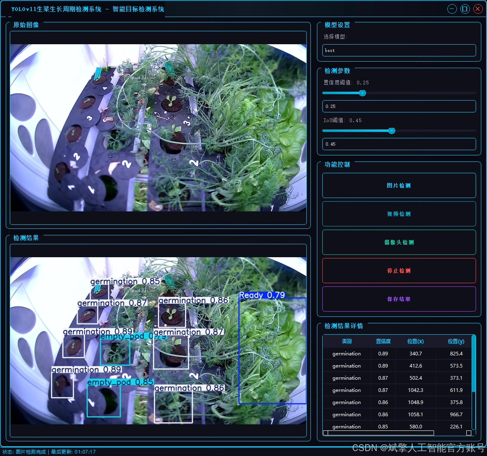
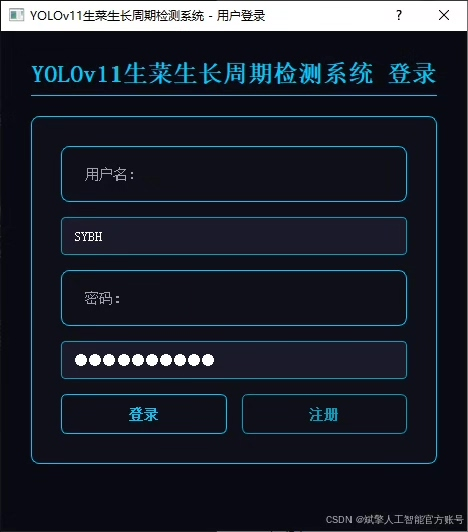
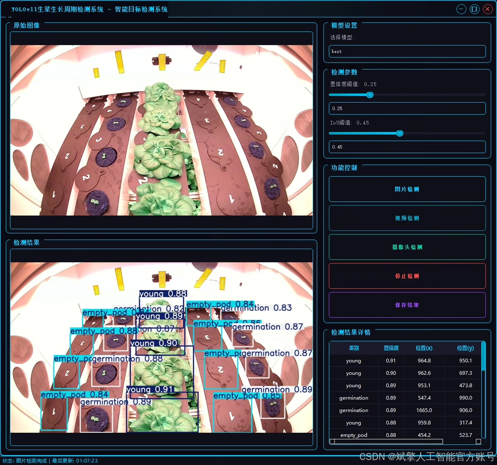
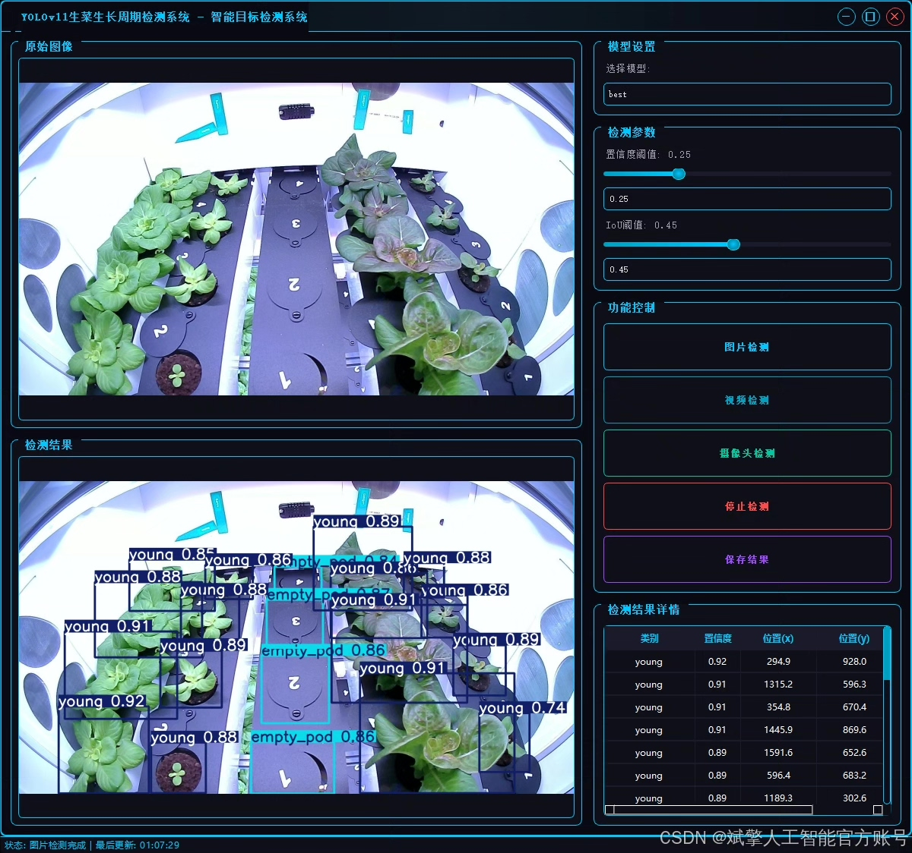
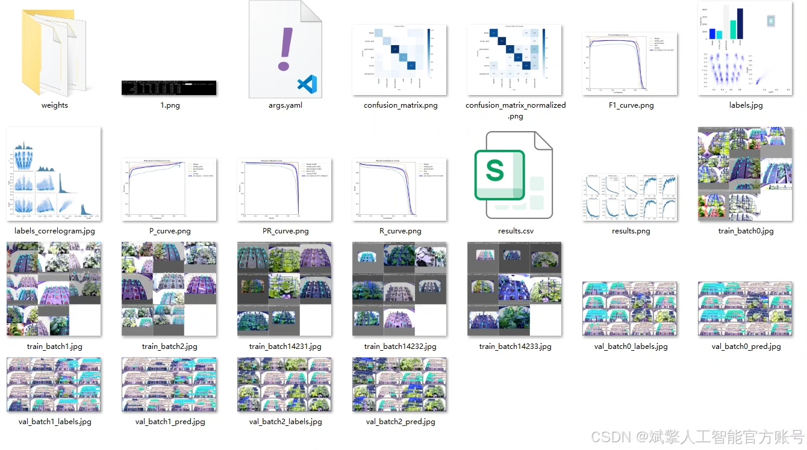
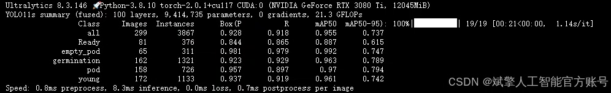
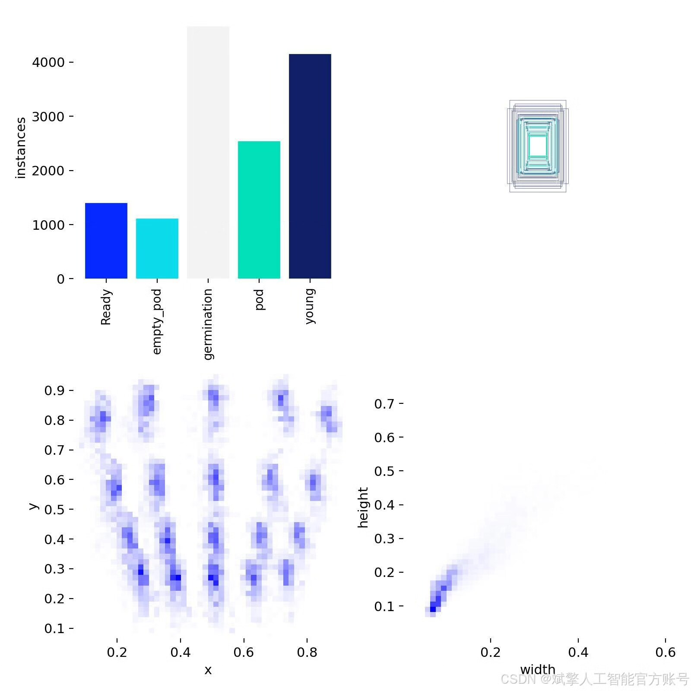
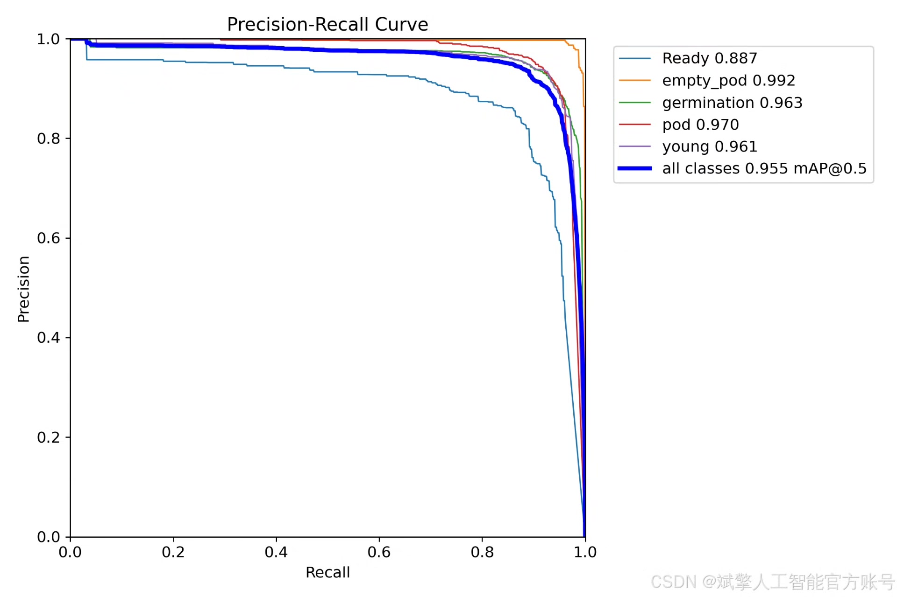
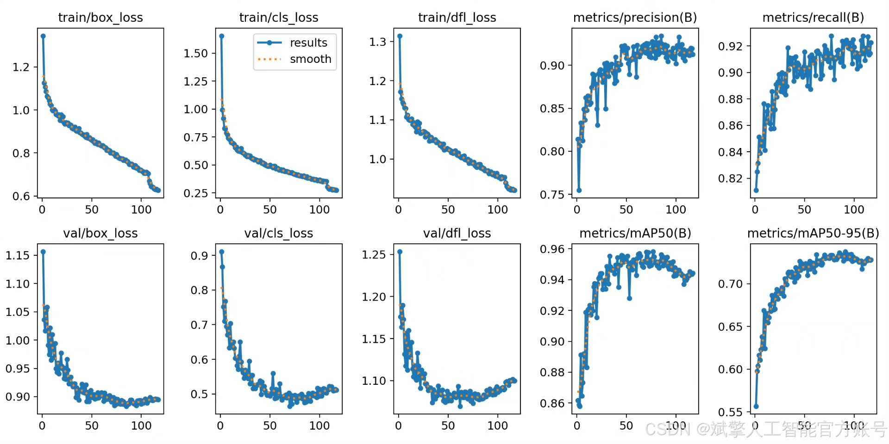

# YOLOv11 Vegetable Growth Detection System

## Body

The lettuce growth detection system based on YOLOv11 is a system that uses the YOLOv11 model to detect the growth cycle of lettuce. The system includes the following components:

1. YOLOv11 dataset: This dataset contains images of lettuce at different stages of growth, such as seedlings, young plants, and mature plants.

2. UI interface: This interface provides users with a visual representation of the lettuce growth cycle. It displays images of the lettuce at different stages and allows users to interact with the system.

3. Login/Registration interface: This interface allows users to log in and register for the system. It requires users to provide their email address and password to access the system.

4. Python project source code: This source code includes the implementation of the YOLOv11 model and the UI interface. It can be used to build and run the system.

5. Model: The YOLOv11 model is a deep learning model that is trained to detect objects in images. It is used in this system to detect the growth cycle of lettuce.

nc:5 classes, 
Names: ['Ready', 'empty_pod', 'germination', 'pod', 'young'],
Number of datasets: 1060 training set, 299 validation set, 151 test set.

✅ User Login and Signup: Supports password detection and security verification.

✅ Three detection modes: based on the YOLOv11 model, support image, video and real-time camera three detection, accurate recognition of targets.

✅ Dual-screen comparison: Display the original image and the detection result on the same screen.

✅ Data Visualization: Real-time table display of detection target categories, confidence and coordinates.

✅ Intelligent Parameter Tuning: Offers a confidence slide, dynamically optimizes detection accuracy to meet different scene requirements.

✅ Sci-fi style interactive interface: dark theme combined with dynamic light effects, reducing visual fatigue and improving operational experience.

## Images

## Payment

Here is a pay link on Stripe ( https://buy.stripe.com/3cs8yP7sY87d0vu9AB ). Please contact me lonlonago@foxmail.com after funding $89, and I will send you a complete data files , thank you!

